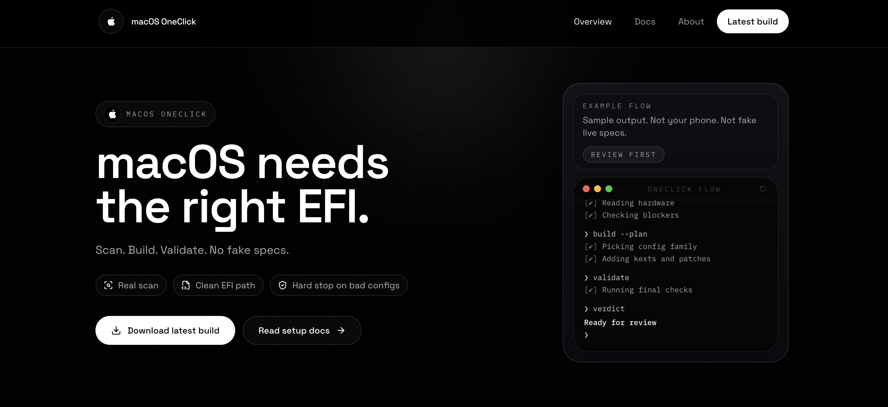

# OpCore-OneClick

<div align="center">

<a href="https://macos-install.one/">
  
</a>

<br/>

[](https://macos-install.one/)
[](https://github.com/redpersongpt/OpCore-OneClick/stargazers)
[](LICENSE)
[](https://x.com/redpersongpt)


</div>

---

OpCore-OneClick turns a PC into a macOS installer in one pass. Run it on the
machine you want to install macOS on: it reads the hardware, tells you which
macOS versions that hardware can run, builds an OpenCore EFI for it, downloads
the macOS recovery image from Apple and writes a bootable USB drive.

The EFI follows the [Dortania OpenCore Install Guide](https://dortania.github.io/OpenCore-Install-Guide/)
for your exact CPU, chipset, graphics, audio, network and input devices, and is
checked with OpenCore's own validator before it is written.

**[Download the latest release](https://github.com/redpersongpt/OpCore-OneClick/releases/latest)**

## How it works

1. **Scan.** On Windows or Linux the app reads the CPU, graphics, chipset,
   audio codec, Ethernet, Wi-Fi, Bluetooth, touchpad, storage and USB
   controllers, and saves the machine's ACPI tables. Nothing on the PC is
   changed. On a Mac (or any other computer) you import a profile that was
   exported on the target PC instead.
2. **Hardware.** Check the detected profile and correct anything that is
   wrong. The profile can be exported here to build on another computer.
3. **Compatibility.** Each component is rated, and you get the list of macOS
   versions this machine can run, with the reason when a newer one is not
   possible (for example a CPU without AVX2 or an unsupported graphics card).
4. **BIOS.** The firmware settings your board needs for that macOS version
   (Secure Boot, CFG Lock, VT-d, Above 4G decoding and so on). Where the app
   can read a setting from the running system, it shows its current state.
5. **Build.** The app plans the EFI (SMBIOS model, kexts, SSDTs, ACPI patches,
   quirks, device properties, boot arguments) and shows the plan before
   anything is downloaded. It then downloads OpenCore and the kexts it needs,
   generates SSDTs from your own ACPI tables, writes `config.plist` and runs
   `ocvalidate`.
6. **Review.** Everything that will be written is shown before you continue.
   You can also export the `EFI` folder.
7. **USB installer.** Pick a USB drive. The app downloads the recovery image
   for the macOS version you chose, verifies it, erases the drive and writes
   the EFI and the installer to it.
8. **Done.** Boot from the USB drive and install macOS. The final screen lists
   the post-install steps for your hardware.

## Supported hardware

The scan decides support per component. As a summary:

| Hardware | Status |
|---|---|
| Intel Core 2 (Penryn) through 10th gen (Comet Lake), desktops and laptops | Supported. The newest macOS depends on the CPU (Penryn: High Sierra, or Catalina with telemetrap; Nehalem to Ivy Bridge: Monterey; Haswell and newer: Tahoe) and on the graphics below |
| Intel 10th gen Ice Lake laptops (Iris Plus G4/G7) | Supported |
| Intel 11th–14th gen desktops (Rocket Lake, Alder Lake, Raptor Lake) | Supported with a supported AMD graphics card; the integrated graphics cannot be used |
| Intel HEDT: X58, X79, X99, X299 | Supported with a supported graphics card |
| AMD FX, A-series and AM1 Athlon (Bulldozer and Jaguar families) | Supported up to macOS 12 Monterey, with a supported graphics card |
| AMD Ryzen and Threadripper desktops (Zen 1 to Zen 5) | Supported with a supported graphics card |
| AMD Ryzen laptops and desktops with Vega graphics (Raven Ridge to Barcelo: Ryzen 2000–5000 and 7030-series APUs, Athlon 200GE/3000G) | Supported through NootedRed (macOS 10.15 and newer) |
| Intel Arrow Lake desktops | Experimental, with a supported AMD graphics card |
| Intel 11th gen and newer laptops (Iris Xe, Arc graphics); AMD laptops with RDNA graphics (Radeon 600M and newer: Ryzen 6000, 7035, 7040 series and later); Atom-class Celeron/Pentium N and N100 | Not supported: their graphics have no macOS driver |

Graphics:

| GPU | macOS |
|---|---|
| Intel HD 3000 (Sandy Bridge) | 10.13 High Sierra |
| Intel HD 4000 (Ivy Bridge) | Up to 11 Big Sur |
| Intel HD/Iris (Haswell, Broadwell) | Up to 12 Monterey |
| Intel HD 520/530, Iris 540/550 (Skylake) | Up to 26 Tahoe; from Ventura on it runs as Kaby Lake through a device-id spoof (Iris Pro 580 and HD 510: up to Monterey) |
| Intel UHD/Iris (Kaby Lake, Coffee Lake, Comet Lake), Iris Plus G4/G7 (Ice Lake) | Up to 26 Tahoe |
| AMD RX 460–590 (Polaris), Vega 56/64, Radeon VII, RX 5500–5700 (Navi 10/14), RX 6600/6600 XT, 6800, 6800 XT, 6900 XT (Navi 21/23) | Native up to 26 Tahoe (Navi 21 from 11.4, Navi 23 from 12.1) |
| AMD RX 6650 XT, RX 6950 XT, RX 6900 XT XTXH | Up to 26 Tahoe through a device-id spoof or NootRX |
| AMD RX 6700/6750 series (Navi 22) | macOS 12 to 26 Tahoe through NootRX |
| AMD HD 7000, R7/R9 200/300 and Fury (GCN 1–3) | Up to 12 Monterey |
| NVIDIA Kepler (GTX 650–780 Ti, GTX Titan, Kepler GT 640/710/720/730) | Up to 11 Big Sur |
| NVIDIA Maxwell and Pascal (GTX 745–1080 Ti, GT 1030) | 10.13.6 High Sierra only, with NVIDIA's web driver installed after macOS |
| AMD RX 6300/6400/6500 (Navi 24), RX 7000, RX 9000; NVIDIA GTX 16 / RTX series | Not supported; disabled so another GPU can drive the display |

Some cards need a device-id spoof that the app adds for you (for example
Lexa-based RX 550/560 variants); a few have no macOS driver at all (RX 580
2048SP, RX 590 GME, and the GT1 graphics of most Pentium and Celeron chips).
The scan checks the exact PCI id, not the marketing name.

macOS 13 Ventura and newer need a CPU with AVX2 (Intel Haswell / 4th gen or
newer except Pentium and Celeron, AMD Zen). CPUs without it stop at Monterey
at the latest; the only way past that is CryptexFixup, which has real
drawbacks (no delta updates, and AMD Polaris, Vega and Navi cards lose
acceleration), so the app says so before you pick it. The app also accounts
for the SMBIOS models Apple still supports in each release, Wi-Fi and
Bluetooth chipsets, audio codecs and Ethernet controllers, and says which
features will not work (for example Intel Wi-Fi needs HeliPort on Tahoe, and
analog audio needs an extra step on Tahoe because Apple removed AppleHDA).

## macOS versions

macOS 10.13 High Sierra through **macOS 26 Tahoe**. Tahoe is the last macOS
that runs on Intel processors: macOS 27 supports Apple silicon only, so no
PC can run it.

## Requirements

| Host | Requirements |
|---|---|
| Windows | Windows 10 or 11, x64, WebView2 (installed with the app if missing). The app asks for administrator rights at launch because partitioning and formatting the USB drive needs them. |
| Linux | x86_64 with glibc 2.35 or newer (Ubuntu 22.04, Debian 12, Fedora 36 and later). Writing the USB drive asks for your password through polkit (`pkexec`) and needs `util-linux`, `fdisk` and `dosfstools`; the `.deb` installs them. The firmware ACPI tables are readable by root only: as a normal user the scan continues without them and says so. The AppImage may need `libfuse2` (`libfuse2t64` on Ubuntu 24.04), or run it with `--appimage-extract-and-run`. |
| macOS | macOS 10.15 or newer. Used to build and write the USB for another PC from an imported profile. |

You also need a USB drive of 4 GB or more (it will be erased) and an Internet
connection. The macOS installer downloads the rest of macOS during the
install, so the target PC needs working Ethernet or Wi-Fi in macOS; the
compatibility step tells you whether it has it.

## Safety

- **Only the USB drive you confirm is written.** Only removable and external
  drives are offered; a disk that holds the running system is shown as
  blocked and cannot be selected. The confirmation is tied to that exact
  drive (model, serial, size), the EFI you built and the recovery image,
  expires after five minutes and works once. The drive is identified again
  right before it is erased.
- **Nothing else on the PC is changed.** BIOS settings are a checklist you
  apply yourself. The app never changes firmware settings, and the only disk
  it erases is the USB drive you confirm.
- **Downloads come from upstream and are verified.** OpenCore, OcBinaryData
  and every kext are downloaded from their upstream projects, pinned to tested
  versions and checked against SHA-256 (NootRX, which only publishes rolling
  builds, is checked structurally instead). The recovery image comes from
  Apple's servers and is checked against Apple's chunklist. The app ships no
  third-party binaries.
- **The config matches the bootloader.** `config.plist` is generated from the
  sample of the same OpenCore release (1.0.8) and validated with that
  release's `ocvalidate`.
- **Your identity stays local.** Serial numbers are generated on your machine
  with `macserial`. There is no telemetry; the app only contacts GitHub (for
  downloads and the update check), the kext download hosts and Apple's
  recovery servers.

## Troubleshooting

- The app's **Troubleshoot** page covers the common boot and install errors
  for your hardware.
- Dortania: [Install Guide](https://dortania.github.io/OpenCore-Install-Guide/),
  [Troubleshooting](https://dortania.github.io/OpenCore-Install-Guide/troubleshooting/troubleshooting.html),
  [Post-Install](https://dortania.github.io/OpenCore-Post-Install/),
  [GPU Buyers Guide](https://dortania.github.io/GPU-Buyers-Guide/).
- To report a problem, use **Settings → Report a problem**, or open an
  [issue](https://github.com/redpersongpt/OpCore-OneClick/issues/new/choose)
  and attach the file from **Settings → Export support log**.

## Building from source

Prerequisites: Node.js 22 LTS, Rust stable
([rustup](https://rustup.rs)) and the [Tauri prerequisites](https://v2.tauri.app/start/prerequisites/)
for your OS (WebView2 on Windows, Xcode Command Line Tools on macOS, WebKitGTK
4.1 development packages on Linux; see [CONTRIBUTING.md](CONTRIBUTING.md#development-setup)).

```bash
git clone https://github.com/redpersongpt/OpCore-OneClick.git
cd OpCore-OneClick
npm ci
npm run tauri:dev      # run in development
npm run tauri:build    # build installers into src-tauri/target/release/bundle
```

Tests:

```bash
npx tsc --noEmit && npx vitest run
cd src-tauri && cargo test && cargo clippy --all-targets -- -D warnings
```

See [CONTRIBUTING.md](CONTRIBUTING.md) for details and
[docs/architecture-map.md](docs/architecture-map.md) for how the code is organised.

## Project Policies

- [Contributing guide](CONTRIBUTING.md)
- [Code of conduct](CODE_OF_CONDUCT.md)
- [Security policy](SECURITY.md)
- [Changelog](CHANGELOG.md)

## Acknowledgements

OpCore-OneClick only automates what these projects made possible. Every
component is downloaded from its upstream release and keeps its own license.

- [Acidanthera](https://github.com/acidanthera): OpenCore, Lilu, WhateverGreen, AppleALC, VirtualSMC, RestrictEvents and the OpenCore utilities (`ocvalidate`, `macserial`, `macrecovery`)
- [Dortania](https://github.com/dortania): the OpenCore Install Guide and post-install guides this app follows
- [OpenIntelWireless](https://github.com/OpenIntelWireless): itlwm, AirportItlwm, IntelBluetoothFirmware, HeliPort
- [Mieze](https://github.com/Mieze): IntelMausi, RealtekRTL8111, LucyRTL8125Ethernet
- [ChefKiss](https://github.com/ChefKissInc): NootedRed, NootRX
- [VoodooI2C](https://github.com/VoodooI2C): VoodooI2C and its satellites
- [USBToolBox](https://github.com/USBToolBox): USB mapping tool and kext
- [AMD-OSX](https://github.com/AMD-OSX): AMD_Vanilla kernel patches
- [corpnewt](https://github.com/corpnewt): SSDTTime, ProperTree, GenSMBIOS

OpCore-OneClick is not affiliated with Apple. macOS is a trademark of Apple
Inc.; read the macOS software license agreement before installing it on
non-Apple hardware. Writing a USB drive erases it: back up anything on it
first.

---

<div align="center">

**[macos-install.one](https://macos-install.one/)** &nbsp;·&nbsp; **[redpersongpt](https://github.com/redpersongpt)** &nbsp;·&nbsp; [](https://x.com/redpersongpt)

[](https://star-history.com/#redpersongpt/OpCore-OneClick&Date)

</div>
